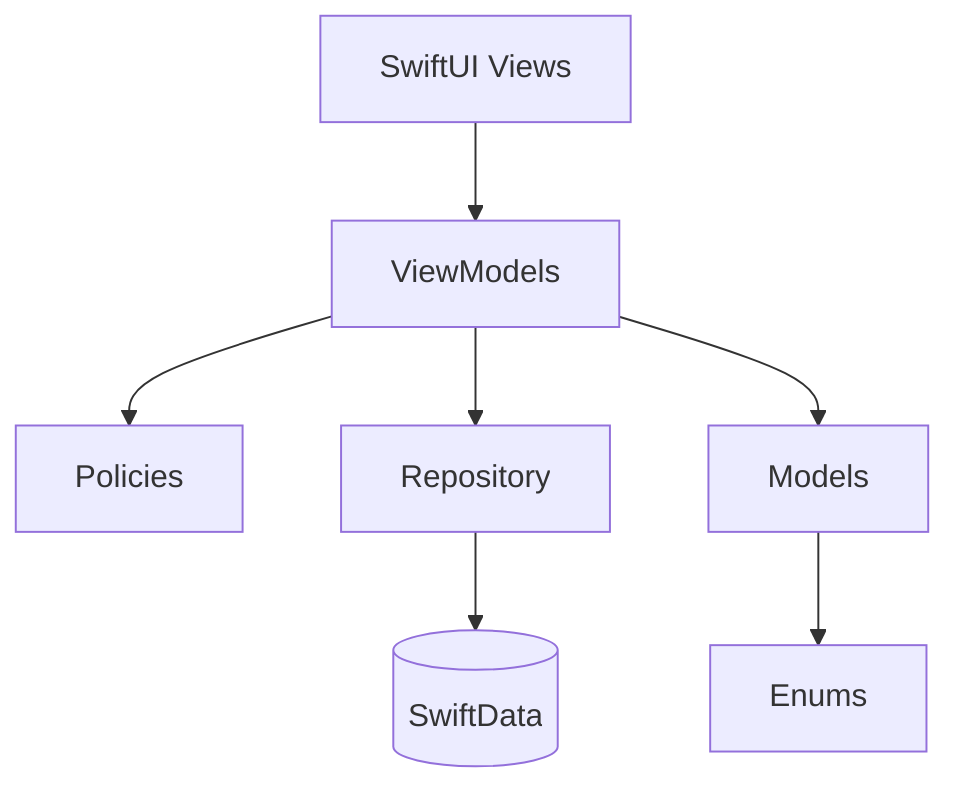

# MyVaultApp

## What is this project?
**MyVaultApp** is a native iOS application designed to help users manage and overcome financial impulsivity. Built upon the principles of the Decision Impulsive Layering Framework, the app acts as a psychological buffer between the urge to buy and the actual purchase. 

Whenever you feel the sudden urge to buy a product, you add it to your "Vault". Instead of allowing an immediate checkout, the app enforces a strict **48-hour cooling-down period (lock)**. During this time, the item is locked, giving your emotions time to settle and preventing buyer's remorse. 

Once the timer finishes, you are prompted to review your initial thoughts through a guided journaling and validation process. By answering a series of emotional and financial questions, MyVaultApp calculates your impulsivity score and helps you make a rational, well-thought-out final decision: to proceed with the purchase or to save your money.

## Tech Stack
- **Language:** Swift
- **UI Framework:** SwiftUI (utilizing modern features like `TimelineView` for highly optimized, localized rendering)
- **Architecture:** MVVM (Model-View-ViewModel)
- **Local Storage:** SwiftData (utilizing type-safe Enums and Codable)
- **Reactive Programming:** Combine (for Timer management and state observation)

## Architecture Overview
MyVaultApp follows MVVM with a small domain layer to keep business rules out of the UI layer:

- **Views:** SwiftUI screens and components in `Views/`. Views bind to `@StateObject` or `@EnvironmentObject` ViewModels and render UI only.
- **ViewModels:** State and orchestration live in `ViewModels/`. ViewModels keep UI state and delegate rules to policies or repositories.
- **Models (Domain + Persistence):**
	- SwiftData models live in `Models/`.
	- Domain rules live in `Models/` as policies (for example `CooldownPolicy` and `ValidationPolicy`).
	- Shared enums are in `Models/Enums/` to keep type safety centralized.
- **Dependencies:** Environment-based injection is used for haptics and persistence, with production defaults and easy overrides in previews/tests.



## Key Architectural Decisions
- **Policies for business rules:** Validation scoring and cooldown calculation are in policy structs, not in ViewModels.
- **Repository boundary:** SwiftData writes are routed through a repository interface to keep persistence isolated and testable.
- **Typed enums for domain safety:** Currency, item status, and question banks are stored as enums or structured types to avoid stringly-typed logic.

## Project Structure
- `Views/` – SwiftUI screens and components
- `ViewModels/` – Presentation logic and UI state
- `Models/` – SwiftData models, policies, and repository interfaces
- `Models/Enums/` – Shared enums and question banks
- `Extensions/` – App-wide helpers (e.g. haptics)
- `docs/` – Architecture notes and best practices

## Project Folder Structure
```
MyVaultApp/
├── MyVaultApp/
│   ├── Assets.xcassets/
│   ├── Extensions/
│   ├── Models/
│   │   ├── Enums/
│   │   │   ├── Currency.swift
│   │   │   ├── ItemStatus.swift
│   │   │   └── QuestionsBank.swift
│   │   ├── CooldownPolicy.swift
│   │   ├── QuestionsModel.swift
│   │   ├── ValidationPolicy.swift
│   │   ├── VaultItemModel.swift
│   │   └── VaultItemRepository.swift
│   ├── ViewModels/
│   ├── Views/
│   └── MyVaultApp.swift
├── MyVaultAppTests/
├── MyVaultApp.xcodeproj/
├── docs/
└── README.md
```
